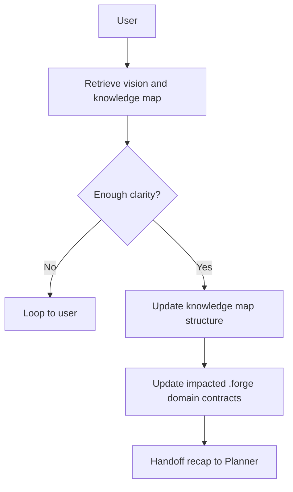

# 2. Architecting (High Level Design)

The Architect Agent performs high-level technical design and directly maintains `.forge` architecture contracts. It retrieves vision, validates clarity, enforces `knowledge_map` structure, updates impacted domain docs, and hands off to Planner.

## Responsibilities

| Owns | Receives | Outputs |
|------|----------|---------|
| `.forge/knowledge_map.json` structure + `.forge/<domain>/` contract docs | User prompt, vision.json | Updated domain contracts; handoff to Planner with recap |

## Behavior Flow

## Flow Steps

1. **Retrieve vision + map** — Read `.forge/vision.json` and `.forge/knowledge_map.json`.
2. **Clarity check** — If direction is unclear, ask for clarification before editing contracts.
3. **Enforce map structure** — Keep contracts inside map-defined domains and paths.
4. **Update impacted domain docs** — Edit only mapped files under `.forge/runtime/`, `.forge/business_logic/`, `.forge/data/`, `.forge/interface/`, `.forge/integration/`, `.forge/operations/`.

## Handoff Contract

- **Inputs**: `.forge/vision.json`, `.forge/knowledge_map.json`, user prompt
- **Output**: Updated domain contracts; handoff to Planner with recap
- **Downstream**: Planner
