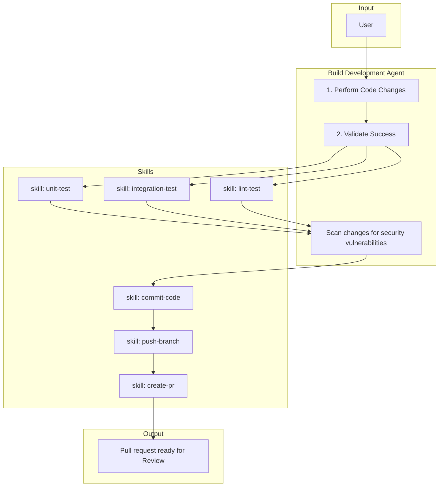

# 5. Building

The Build Development Agent implements code changes, validates success with tests, scans for security vulnerabilities, then commits, pushes, and creates a PR. It uses explicit skills for each validation and publish step.

## Responsibilities

| Owns | Receives | Outputs |
|------|----------|---------|
| Implementation, validation, security scan | Refined sub-issue (GitHub issue link) | Pull request; handoff to Review |

## Behavior Flow

## Flow Steps

1. **Perform Code Changes** — Implement subtask-scoped code changes from the refined sub-issue. Ensure branch exists (run `create-feature-branch` from parent if missing).
2. **Validate Success** — Run validation skills:
   - **skill: unit-test** — Resolve from `.forge/skill_registry.json`
   - **skill: integration-test** — Resolve from `.forge/skill_registry.json`
   - **skill: lint-test** — Resolve from `.forge/skill_registry.json`
3. **Scan changes for security vulnerabilities** — Examine the changeset for security risks before proceeding.
4. **skill: commit-code** — Commit approved changes using the commit skill.
5. **skill: push-branch** — Push branch state to remote.
6. **skill: create-pr** — Create pull request for review handoff. Use `.github/pull_request_template.md` if present.

## Skill Resolution

Resolve assigned skills from `.forge/skill_registry.json` at `agent_assignments.build` and `agent_assignments.build_wrap`.

## Handoff Contract

- **Inputs**: Refined sub-issue, branch context
- **Output**: Pull request ready for Review
- **Downstream**: Review Agent (human performs merge)
