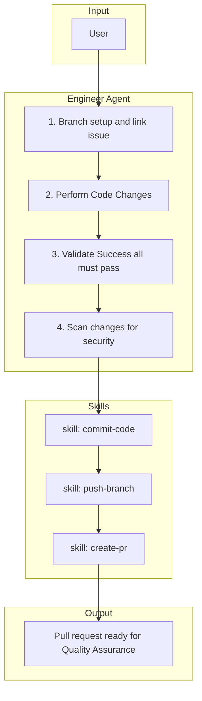

# 5. Building

The **Engineer** agent owns the implementation branch for the issue being built, implements code changes, runs automated validation until everything passes, scans for security issues, then commits, pushes, and creates a PR.

## Responsibilities

| Owns | Receives | Outputs |
|------|----------|---------|
| Branch creation/link for target issue, implementation, validation, security scan | Refined GitHub issue link (parent or sub-issue) | Pull request; handoff to Quality Assurance |

## Behavior Flow

## Flow Steps

1. **Branch setup and link** — For the issue in the build link: build-from-github ensures the correct branch before handoff; if not on the issue branch, run branch setup: create/checkout `feature/issue-{N}` from `main` (top-level) or `feature/issue-{parent}` (sub-issue). Push when needed; link to that issue via `gh issue develop` or MCP if missing.
2. **Perform Code Changes** — Implement scoped changes from the issue body; read the parent issue when the build target is a sub-issue.
3. **Validate Success** — Run repository-inferred validation (tests/lint/build as applicable). Re-run after substantive edits. **Do not** commit or create a PR until each required check exits successfully.
4. **Scan changes for security vulnerabilities** — Examine the changeset for security risks before proceeding.
5. **skill: commit-code** — Commit approved changes using the commit skill.
6. **skill: push-branch** — Push branch state to remote.
7. **skill: create-pr** — Create pull request for review handoff. Use `.github/pull_request_template.md` if present.

## Skill Resolution

Resolve assigned skills from `.forge/skill_registry.json` at `agent_assignments.engineer`.

## Handoff Contract

- **Inputs**: GitHub issue link (parent or sub-issue), branch context
- **Output**: Pull request ready for Quality Assurance
- **Downstream**: Quality Assurance agent (human performs merge)
