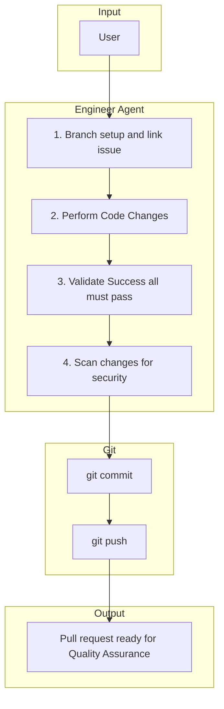

# 5. Building

The **Engineer** agent uses **`resolve-issue-parentage`** (then **`feature/issue-{branch_owner_issue}`**), implements code changes, runs automated validation until everything passes, scans for security issues, then **`git commit`**, **`git push`**, and **ensures a PR exists**—often by **updating** an existing PR for that head when sub-issues share the parent branch (see **`resources/workflow/skills/build-from-github/SKILL.md`**). **Refinement** does not create branches; branch setup is **development-phase** work.

## Responsibilities

| Owns | Receives | Outputs |
|------|----------|---------|
| Branch creation/link for target issue, implementation, validation, security scan | Refined GitHub issue link (parent or sub-issue) | Pull request (new or updated); handoff to Quality Assurance |

## Behavior Flow

## Flow Steps

1. **Branch setup and link** — Run **`resolve-issue-parentage`**, then ensure **`suggested_branch`** exists and is linked to **`branch_owner_issue`** per **`resources/workflow/skills/build-from-github/SKILL.md`**. Do not use the child issue number for the branch when **`input_issue`** ≠ **`branch_owner_issue`**. Push when needed; link via `gh issue develop` or MCP.
2. **GitHub Projects (when `github_board` is set)** — Follow **`build-from-github`** skill: at build **start**, **In Progress** on **`input_issue`** for a standalone parent (no sub-issues); **In Progress** on **parent and sub** when building a sub-issue; **In Progress** on the parent only when building the parent ticket but sub-issues still exist. After a **PR** exists: **Done** on the **sub-issue** when that build was for a sub-issue; **In Review** on the issue when the work is a standalone parent or when **every** sub-issue is **CLOSED** and a PR exists for the parent branch. Use **`gh-project-set-status`** from `.forge/skill_registry.json`.
3. **Perform Code Changes** — Implement scoped changes from the issue body; read the parent issue when the build target is a sub-issue.
4. **Contract fidelity (targeted)** — If implementation establishes a **material decision** that should be documented and mapped `.forge` contracts are missing or misleading, patch the mapped contract with a minimal current-state edit; escalate structural or cross-domain changes to Architect.
5. **Validate Success** — Run repository-inferred validation (tests/lint/build as applicable). Re-run after substantive edits. **Do not** commit or create a PR until each required check exits successfully.
6. **Scan changes for security vulnerabilities** — Examine the changeset for security risks before proceeding.
7. **Git commit** — Stage and commit with conventional messages (see repo CONTRIBUTING). Do not commit on **`main`** / **`master`** / **`develop`**.
8. **Git push** — **`git fetch origin`**, then **`git push -u origin HEAD`** if no upstream, else **`git push origin HEAD`**.
9. **PR (GitHub MCP or `gh`)** — Use `gh pr list --head "feature/issue-{branch_owner_issue}" --state open --limit 1 --json number` (add `-R owner/repo` when needed; `gh pr view` has no `--head`) then `gh pr view <number>` if found, or MCP; **update** an existing PR or **create** one. Use `.github/pull_request_template.md` if present.
10. **Forge workflow retrospective** — Run **`forge-post-workflow-retrospective`** (`issue` mode) on **`input_issue`** after PR and board updates; see Engineer agent and **`build-from-github`** skill.

## Skill Resolution

Resolve **script** skills from `.forge/skill_registry.json` at `agent_assignments.engineer` (entries with `script_path`). Commit/push: use **git** as in this doc and **`build-from-github`** skill. PR creation uses GitHub MCP or `gh` CLI (not a Forge skill id).

## Handoff Contract

- **Inputs**: GitHub issue link (parent or sub-issue), branch context
- **Output**: Pull request ready for Quality Assurance
- **Downstream**: Quality Assurance agent (human performs merge)
