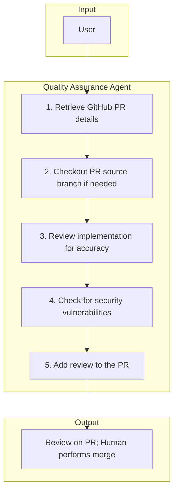

# 6. Quality Assurance (Reviewing)

The Quality Assurance Agent reviews pull requests for correctness and security, posts findings to GitHub, and never merges. A human performs the merge.

## Responsibilities

| Owns | Receives | Outputs |
|------|----------|---------|
| PR review quality and security verdict | PR link | Review comments on PR; human performs merge |

## Behavior Flow

## Flow Steps

1. **Retrieve GitHub PR details** — Use GitHub MCP or gh CLI to fetch PR title, body, files changed, linked issues, and CI results.
2. **Checkout PR source branch (when needed)** — Fetch and checkout the PR branch locally for verification.
3. **Review implementation for accuracy** — Examine changeset for correctness, alignment with issue intent, and acceptance criteria.
4. **Check for security vulnerabilities** — Examine the diff for vulnerability risks, unsafe patterns, and security regressions.
5. **Add the review to the PR** — Post review comments and verdict. Do not merge; a human performs the merge.

## Handoff Contract

- **Inputs**: PR link
- **Output**: Review comments on PR; human performs merge
- **Downstream**: Maintainers and merge workflows
