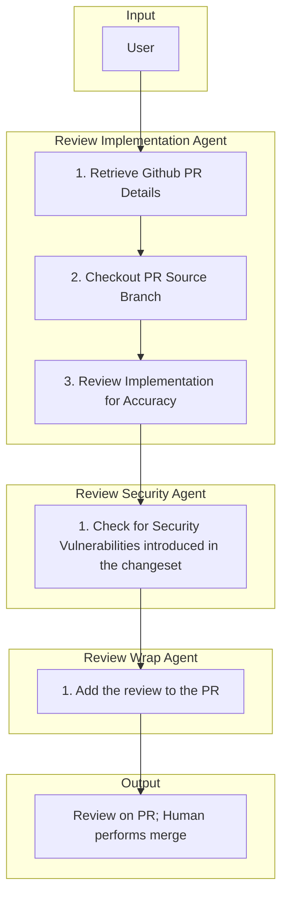

# 6. Quality Assurance (Reviewing)

The Review flow uses three sequential subagents: Review Implementation Agent, Review Security Agent, and Review Wrap Agent. Each performs a distinct step before the next. A human performs the merge.

## Responsibilities

| Owns | Receives | Outputs |
|------|----------|---------|
| PR review (implementation, security, wrap) | PR link | Review comments on PR; human performs merge |

## Behavior Flow

## Flow Steps

### Review Implementation Agent

1. **Retrieve Github PR Details** — Use GitHub MCP or gh CLI to fetch PR title, body, files changed.
2. **Checkout PR Source Branch** — Fetch and checkout the PR branch locally.
3. **Review Implementation for Accuracy** — Examine changeset for correctness, alignment with issue intent and acceptance criteria.

### Review Security Agent

1. **Check for Security Vulnerabilities introduced in the changeset** — Examine the diff for vulnerability risks, unsafe patterns, and security regressions.

### Review Wrap Agent

1. **Add the review to the PR** — Post review comments via `mcp_github_pull_request_review_write` and `mcp_github_add_comment_to_pending_review`. Do not merge; a human performs the merge.

## Handoff Contract

- **Inputs**: PR link
- **Output**: Review comments on PR; human performs merge
- **Downstream**: Maintainers and merge workflows
