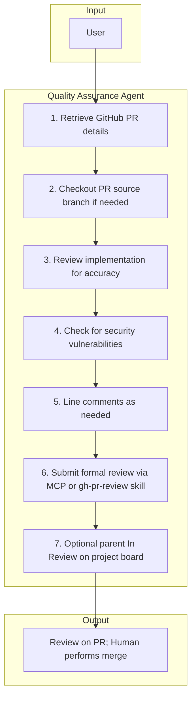

# 6. Quality Assurance (Reviewing)

The Quality Assurance Agent reviews pull requests for correctness and security, posts line comments, **submits a formal GitHub review** (approve / request changes / comment) with a body, and never merges. A human performs the merge.

## Responsibilities

| Owns | Receives | Outputs |
|------|----------|---------|
| PR review quality and security verdict | PR link | Submitted review on PR + line comments; human performs merge |

## Behavior Flow

## Flow Steps

1. **Retrieve GitHub PR details** — Use GitHub MCP or gh CLI to fetch PR title, body, files changed, linked issues, and CI results.
2. **Checkout PR source branch (when needed)** — Fetch and checkout the PR branch locally for verification.
3. **Review implementation for accuracy** — Examine changeset for correctness, alignment with issue intent, and acceptance criteria.
4. **Check for security vulnerabilities** — Examine the diff for vulnerability risks, unsafe patterns, and security regressions.
5. **Add line-level comments** — Where they clarify requested changes or risks.
6. **Submit the formal PR review** — Non-empty body; **APPROVE**, **REQUEST_CHANGES**, or **COMMENT** via MCP `pull_request_review_write`, or **`gh-pr-review`** skill as fallback.
7. **Optional project board** — If all sub-issues of the parent are closed, set parent to **In Review** using **`gh-project-set-status`** and **`github_board`** from `.forge/project.json`.

## Handoff Contract

- **Inputs**: PR link
- **Output**: Submitted GitHub review and comments on PR; human performs merge
- **Downstream**: Maintainers and merge workflows
