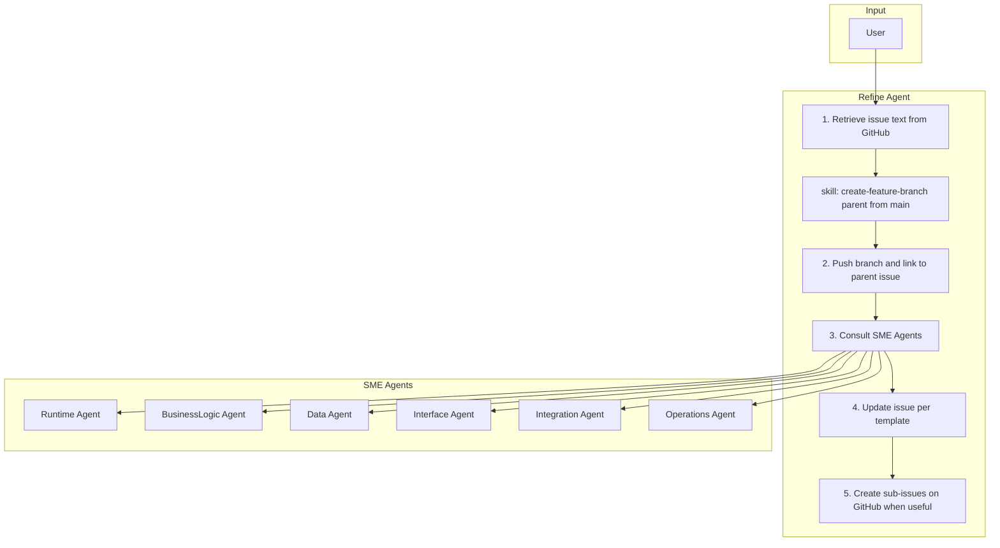

# 4. Refining

The Refine Agent maintains development-ready GitHub issues. It retrieves issue text, creates the **parent** feature branch, pushes and links it to the parent issue, consults SME Agents, updates the issue per template, and optionally creates sub-issues on GitHub (without creating a git branch per sub-issue).

## Responsibilities

| Owns | Receives | Outputs |
|------|----------|---------|
| Issue refinement, optional sub-issues on GitHub, parent branch + link | GitHub issue link, vision, knowledge_map context | Parent branch pushed and linked; refined tickets; handoff to Build |

## Behavior Flow

## Flow Steps

1. **Retrieve issue text from GitHub** — Use available tools (GitHub MCP, gh CLI) to fetch the issue content.
2. **skill: create-feature-branch** — Create parent branch from `main`: `create-feature-branch feature/issue-{parent-number} main`.
3. **Push and link** — Push to `origin` (use **push-branch** from skill registry when assigned); link the branch to the parent issue via GitHub Development / `gh issue develop` / MCP.
4. **Consult SME Agents** — Invoke Runtime, BusinessLogic, Data, Interface, Integration, Operations for technical information and implementation guides.
5. **Update issue based on issue template** — Ensure all required details are included per the project's issue template.
6. **Create sub-issues when useful** — Create child issues on GitHub when a breakdown helps (including a single sub-issue). Build creates `feature/issue-{child}` when implementing each issue.

## Handoff Contract

- **Inputs**: Planner ticket, vision, knowledge_map context
- **Output**: Parent branch pushed and linked; refined parent and optional sub-issues on GitHub; implementation branches are created in Build
- **Downstream**: Build Agent
