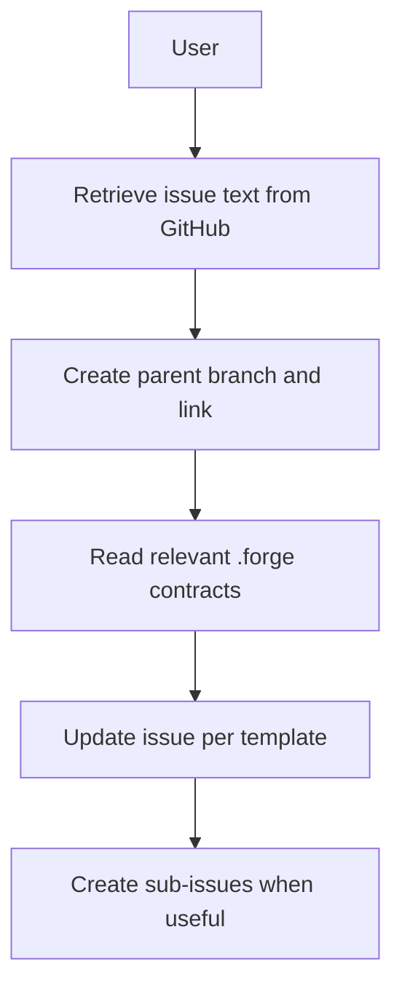

# 4. Technical Writer (Ticket Refining Subagent)

The Technical Writer Agent maintains development-ready GitHub issues. It retrieves issue text, creates the **parent** feature branch (push and link via `gh issue develop` or equivalent), reads relevant `.forge` contracts for context, updates the issue per template, and creates sub-issues on GitHub when useful—without creating a git branch per sub-issue. Sub-issue branches are created by build-from-github or the Engineer when work starts.

## Responsibilities

| Owns | Receives | Outputs |
|------|----------|---------|
| Issue refinement, sub-issues on GitHub (no sub-issue branches), parent branch + link | GitHub issue link, vision, knowledge_map context | Parent branch pushed and linked; refined tickets; handoff to Engineer |

## Behavior Flow

## Flow Steps

1. **Retrieve issue text from GitHub** — Use available tools (GitHub MCP, gh CLI) to fetch the issue content.
2. **Create parent branch and link** — Use `gh issue develop <parent-issue-number> --name feature/issue-{parent-number} --base main --checkout` when available; otherwise `.cursor/skills/create-issue-branch/scripts/create-issue-branch.sh <owner/repo> feature/issue-{parent-number} <parent-issue-number> main` and link via push + MCP/gh if needed. Push to `origin` so the branch is visible.
3. **Read `.forge` contracts** — Use `.forge/knowledge_map.json` to read relevant domain docs for technical context. Escalate contract changes to Architect.
4. **Update issue based on issue template** — Ensure all required details are included per the project's issue template.
5. **Create sub-issues when useful** — Create child issues on GitHub when a breakdown helps (including a single sub-issue). Do not create branches for sub-issues; build-from-github or the Engineer creates `feature/issue-{child}` when implementing.

## Handoff Contract

- **Inputs**: Planner ticket, vision, knowledge_map context
- **Output**: Parent branch pushed and linked; refined parent and sub-issues on GitHub (no sub-issue branches); child branches created by build-from-github or Engineer when work starts
- **Downstream**: Engineer Agent
