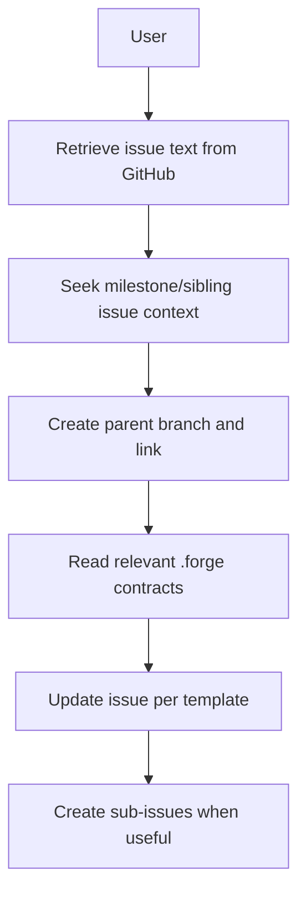

# 4. Technical Writer (Ticket Refining Subagent)

The Technical Writer Agent maintains development-ready GitHub issues. The command (`/refine-issue`) defines invocation contract (input normalization, delegation, output checks), and the Technical Writer agent defines execution behavior for refinement. The agent retrieves issue text, creates the **parent** feature branch (push and link via `gh issue develop` or equivalent), reads relevant `.forge` contracts for context, updates issue content, and creates sub-issues on GitHub when useful—without creating a git branch per sub-issue. Sub-issue branches are created by build-from-github or the Engineer when work starts.

## Precedence

- `resources/workflow/commands/refine-issue.md`: invocation contract and required outputs.
- `resources/workflow/agents/tech-writer.md`: refinement behavior and policy details.
- If they conflict, command governs invocation/output checks; agent governs execution behavior.

## Responsibilities

| Owns | Receives | Outputs |
|------|----------|---------|
| Issue refinement, sub-issues on GitHub (no sub-issue branches), parent branch + link | GitHub issue link, vision, knowledge_map context | Parent branch pushed and linked; refined tickets; handoff to Engineer |

## Behavior Flow

## Flow Steps

1. **Retrieve issue text from GitHub** — Use available tools (GitHub MCP, gh CLI) to fetch the issue content.
2. **Seek broader context** — Pull related milestone/sibling issues and relevant keywords to place the issue in the wider delivery plan.
3. **Create parent branch and link** — Use `gh issue develop <parent-issue-number> --name feature/issue-{parent-number} --base main --checkout` when available; otherwise resolve and run `create-issue-branch` and `push-branch` via `.forge/skill_registry.json`, then link via MCP/gh.
4. **Read `.forge` contracts** — Use `.forge/knowledge_map.json` to read relevant domain docs for technical context. If refinement establishes a **material decision** that should be documented and the mapped contract is missing or misleading, patch it with a minimal current-state update; escalate structural or cross-domain changes to Architect.
5. **Update issue based on issue template** — Ensure all required details are included per the project's issue template.
6. **Create sub-issues when useful** — Create child issues on GitHub when a breakdown helps (including a single sub-issue). Do not create branches for sub-issues; build-from-github or the Engineer creates `feature/issue-{child}` when implementing.

## Mandatory Ticket Formats

- **Parent issues**
  - User story
  - How to test locally
  - Acceptance criteria
- **Sub-issues**
  - Technical goal
  - Technical implementation steps
  - How to test locally
  - Acceptance criteria

## Handoff Contract

- **Inputs**: Planner ticket, vision, knowledge_map context
- **Output**: Parent branch pushed and linked; refined parent and sub-issues on GitHub (no sub-issue branches); child branches created by build-from-github or Engineer when work starts
- **Downstream**: Engineer Agent
