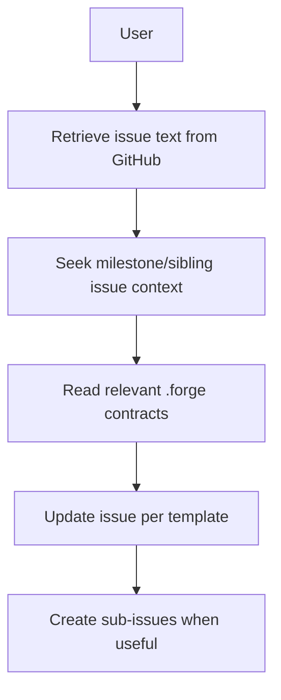

# 4. Technical Writer (Ticket Refining Subagent)

The Technical Writer Agent maintains development-ready GitHub issues. The command (`/refine-issue`) defines invocation contract (input normalization, parent resolution when the link is a sub-issue, delegation, output checks), and the Technical Writer agent defines execution behavior for refinement. The agent retrieves issue text, reads relevant `.forge` contracts for context, updates issue content, and creates sub-issues on GitHub when useful. **Refinement does not create git branches.** **Engineer** and **`/build-from-github`** run **`resolve-issue-parentage`** and create **`feature/issue-{branch_owner_issue}`** when implementation starts; sub-issues never get a child-named branch.

## Precedence

- `resources/workflow/commands/refine-issue.md`: invocation contract and required outputs.
- `resources/workflow/agents/technical-writer.md`: refinement behavior and policy details.
- If they conflict, command governs invocation/output checks; agent governs execution behavior.

## Responsibilities

| Owns | Receives | Outputs |
|------|----------|---------|
| Issue refinement, sub-issues on GitHub (Git only in this phase) | GitHub issue link (normalized to parent by orchestration when needed), vision, knowledge_map context | Refined parent and optional sub-issues; handoff to Engineer |

## Behavior Flow

## Flow Steps

1. **Retrieve issue text from GitHub** — Use available tools (GitHub MCP, gh CLI) to fetch the issue content (orchestration passes the **parent** when the user linked a sub-issue).
2. **Seek broader context** — Pull related milestone/sibling issues and relevant keywords to place the issue in the wider delivery plan.
3. **Read `.forge` contracts** — Use `.forge/knowledge_map.json` to read relevant domain docs for technical context. If refinement establishes a **material decision** that should be documented and the mapped contract is missing or misleading, patch it with a minimal current-state update; escalate structural or cross-domain changes to Architect.
4. **Update issue based on issue template** — Ensure all required details are included per the project's issue template.
5. **Create sub-issues when useful** — Create child issues on GitHub when a breakdown helps (including a single sub-issue). Link with **`link-subissue-to-issue`**. **Do not** create git branches during refinement.

## Mandatory Ticket Formats

- **Parent issues**
  - User story
  - How to test locally
  - Acceptance criteria
- **Sub-issues**
  - Technical goal
  - Technical implementation steps
  - How to test locally
  - Acceptance criteria

## Handoff Contract

- **Inputs**: Planner ticket, vision, knowledge_map context
- **Output**: Refined parent and sub-issues on GitHub; branches are created in **`/build-from-github`** via **`resolve-issue-parentage`** and **`feature/issue-{branch_owner_issue}`**
- **Downstream**: Engineer Agent
